**PMem相关专业术语**

资料来源：[https://pmem.io/glossary/](https://pmem.io/glossary/)

您可以在此处找到与持久内存(PMem)相关的术语列表。其中许多术语具有广泛的含义，但以下介绍特别关注它们与PMem的关系。

[TOC]

### 1LM

(One-level Memory)

​		**1LM**指的是内存没有使用任何内存端缓存来连接到系统的形式。**DRAM**或**system main memory**介绍时会提到，另外会使用**1LM**来明确说明相关内存未配置为[2LM](#2lm)。


### 2LM

(Two-level Memory)

​		持久内存有时配置为**2LM**，其中硬件管理两个级别（层）的内存。它是[Intel傲腾Optane PMem产品](#optane)的一个功能 ，该功能配置称为 [内存模式](#memory-mode)）。


### 3D XPoint

​		3D XPoint（读作*three dee cross point*）是 [Intel傲腾Optane](#optane)产品线中使用的介质，该介质分为固态磁盘(SSD) 产品和持久性内存(PMem) 产品。更多细节查看[英特尔的网站](http://intel.com/optane)、[维基百科](https://en.wikipedia.org/wiki/3D_XPoint)


### ADR

(Asychronous DRAM Refresh)

​		**ADR**是一种硬件功能，可在断电时将存储数据从__内存控制器写入挂起队列 (WPQ) __刷到其目的地。ADR 也可以选择性地刷I/O控制器里pending的 DMA 存储数据。

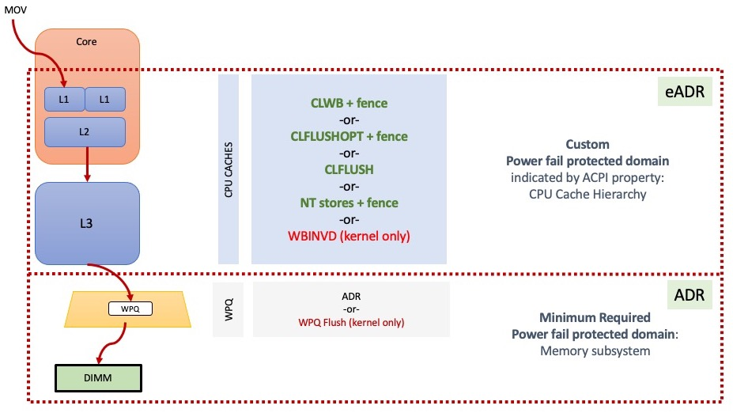

​		如上图所示，在通往持久内存 DIMM 的途中，存储数据可以驻留在多个位置。下面的红色虚线框显示了 ADR 域——到达该域的存储受到 ADR 的断电保护，ADR 会flushes内存控制器中的队列，如图中的梯形所示。所有支持持久内存的 Intel 系统都需要 ADR，这意味着必须在平台级别（包括 CPU、主板、电源、DIMM 和 BIOS）支持该功能。所有 [NVDIMM-N](#nvdimm)产品以及 Intel 的[傲腾Optane](#optane) PMem 都需要系统支持 ADR 。

​		ADR 使用储存的电能在断电后执行flushes。存储的电能通常来自电源中的电容器，但也可以通过其他方式实现，例如电池或 UPS。

​		图中较大的红色虚线框说明了一个可选功能 [eADR](#eadr)，其中 CPU 缓存也会在断电时flushes。


### App Direct

(Application Direct)

​		[Intel 傲腾Optane PMem](#optane)产品可以配置为两种模式：**App Direct**和[Memory Mode](#memory-mode)。有关产品详细信息，请参阅 [英特尔傲腾网站](http://intel.com/optane)。App Direct 模式提供 [持久内存编程模型](#programming-model)。

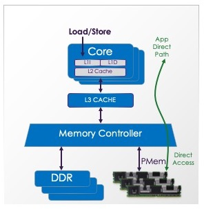

​		以这种方式配置时，操作系统可以对持久化内存感知应用程序提供直接访问或[DAX](#dax)。这种方式允许应用程序像加载/存储内存一样访问持久化数据。


### ARS

(Address Range Scrub)

​		[NVDIMM](#nvdimm)产品可能提供一个接口，允许操作系统发现设备上的已知损坏的位置。 提前发现这些[bad blocks ](#bad-blocks)可以让应用程序避免使用损坏的位置，从而避免会杀死应用程序的相关异常。

​		ARS 接口通过[DSM](#dsm)提供。用于地址范围清理的 DSM 由 ACPI 规范描述，可在 [UEFI 网站上获得](https://uefi.org/)。

> 原文poison个人译为损坏，欢迎指正


### Bad Blocks

​		操作系统可以跟踪持久存储设备上的已知**Bad Blocks**列表。这些块可能会使用某些 NVDIMM 支持的地址范围扫描 ( [ARS](#ars) ) 操作来发现，或者当软件尝试使用某个位置但返回已损坏时被即时发现。

​		对于服务器上的常见的易失性内存 normal volatile memory （即 DRAM），不可纠正的错误将导致向使用它的应用程序返回一个*损坏*值。在 Intel 平台上，使用损坏值会导致*机器检查*，进而导致内核向使用的进程发送异常。在 Linux 上，异常采用 SIGBUS 信号的形式，大多数应用程序将因此挂掉。重新启动时，问题会消失，因为应用程序从头开始分配易失性内存，操作系统将隔离 sequestered 包含损坏的页面。

​		持久内存增加了这种情况的复杂性。同上面的 Linux 示例，应用使用了持久内存的损坏值导致相同的 SIGBUS，但是如果应用程序挂掉并重新启动，它很可能会读取相同的位置，因为程序可能存在持久性的场景——操作系统不能像易失性内存那样用新页面替换旧页面，因为它需要保留损坏来表示数据丢失。

​		ECC 信息用于检测不可纠正的错误，通常以缓存行形式维护，缓存行在 Intel 系统上为 64 字节。但是根据[blast-radius](#blast-radius)效应，这个小范围错误可以进制rounded up到更大的范围。

​		为了防止__感知PMem的应用程序__重复启动、使用损坏位置甚至挂掉的不当行为，操作系统为应用程序提供了一种访问已知**Bad Blocks**列表的方法。在 Linux 上， 也可以使用**ndctl**命令查看此信息：

```
# ndctl list --media-errors
```

​		**libndctl**提供的 API允许应用程序直接访问此信息，并且 PMDK 库使用该 API 来防止在 PMem 池包含已知**Bad Blocks**时被使用。在这种情况下，应用程序采取的常见操作是拒绝继续使用，迫使系统管理员从备份或冗余副本中恢复池数据。当然，应用程序可以尝试直接修复池，但这会导致应用程序逻辑更复杂。

​		[Intel 的 PMem RAS 页面](https://software.intel.com/content/www/us/en/develop/articles/pmem-RAS.html) 包含有关此主题的更多信息，重点介绍 傲腾Optane PMem 产品。


### Blast Radius

​		当[persistent-memory](#persistent-memory)某个位置遇到无法纠正的错误时，该数据就会丢失。Intel 平台上的内存以 64 字节缓存行的形式访问，但在某些情况下，丢失单个位置可能会导致应用程序丢失更大的数据块。这被称为**Blast Radius**效应。

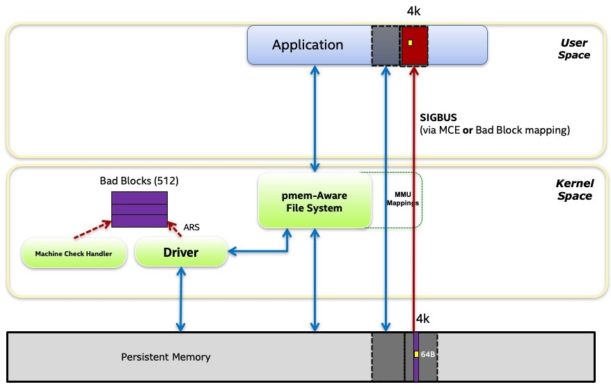

​		如上图所示，包含64 字节损坏位置（例如不可纠正的错误）可能会使其损坏大小进制为该设备用作其*ECC 块大小的任何值*。Linux 操作系统可以通过[ARS](https://pmem.io/glossary/#ars)机制发现这些损坏位置。Linux 内核中使用 以512字节块的数据结构来追踪这些区域的[Bad Blocks](#bad-blocks)，因此损坏大小将进制到 512 字节。如果应用程序内存映射该文件，操作系统将在该位置映射一个无效page，再次将大小进制到更大的 4096 字节（Intel系统上的page大小）。


### Block Storage

(Storage, Disk)

​		将传统存储与持久内存进行比较时，主要区别如下：

- 块存储的接口是基于块的。软件只能读一个块或写一个块。文件系统通常根据需要通过将块[paging](#paging) 来存储或提取数据。

- PMem 的接口是字节寻址的。软件可以读取或写入任何大小的数据而无需分页。持久数据就地访问，减少了 DRAM 保存缓冲数据的需要。
- 移动块（例如 4k 数据）时，NVMe SSD 等块存储设备会启动 DMA 到内存。这允许 CPU 在等待数据传输时执行其他工作。
- PMem 作为[NVDIMM](#nvdimm)实现，连接到内存总线，无法启动 DMA。移动 4k 的数据，通常是 CPU 移动数据，这比存储设备的延迟低，但 CPU 利用率更高。对此的一种潜在解决方案是使用 DMA 引擎（如果平台提供）。
- PMem 可以模拟块存储设备，事实上这是 [PMem 编程模型的一部分](#programming-model)。但块存储无法模拟 PMem，因为它从根本上是不可字节寻址的。分页可以接近模拟 PMem，尤其是对于快速 SSD，但将修改数据刷新持久化仍需要执行具有块存储的内核代码，其中 PMem 可以直接从用户空间刷新持化（有关详细信息，请参阅[ADR](https://pmem.io/glossary/#adr) 和[eADR](#eadr)）。

​		另请参阅[BTT](#btt)以了解有关 PMem 如何模拟块存储的详细信息。


### BTT

(Block Translation Table)

​		**BTT**算法提供了断电时单块原子性写入持久化存储器顶部的能力。这允许 PMem 模拟存储并提供与 NVMe 类似的语义。NVMe 存储要求断电时至少以块形式原子性写入，这意味着在断电期间写入的块将被完全写入或根本不写入。由于软件可能依赖于这个存储属性，BTT 算法被设计为在软件中实现相同的语义。该算法被标准化为[UEFI 的](https://uefi.org/)一部分。

​		有关 BTT 工作原理的介绍，可简单参考[此博文](https://pmem.io/2014/09/23/btt.html)，此文是由实现 BTT 的 Linux 维护者 Vishal Verma 撰写。


### CLFLUSHOPT

(Instruction: Cache Line Flush, Optimized)

​		Intel 指令集长期以来一直包含一个缓存刷新指令 CLFLUSH，它将从 CPU 缓存中失效特定的缓存行。CLFLUSH 的定义早于 [persistent-memory](#persistent-memory)，其包含[fence](#fence)作为指令一部分。这意味着由于每次刷新之间的fence，用于刷新一系列缓存行的 一组 CLFLUSH 指令将被串行化。随着持久内存的出现，Intel 引入了**CLFLUSHOPT**指令，该指令通过去除嵌入式fence操作进行了优化。因此，一组 CLFLUSHOPT 指令启动刷新，将允许一定的并行度。这样的一组命令执行后要执行[fence](#fence)作为结束，确认在软件继续之前该范围内的存储数据已持久化。

​		CLFLUSHOPT 指令总是失效缓存行，这意味着对该地址的下一次访问将是 CPU 缓存未命中，即使它在刚刷新后不久发生。将此与[CLWB](#clwb) 指令进行比较，CLWB指令允许该缓存行保持有效。

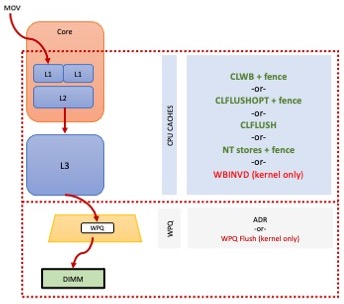

> 原文evict个人译为失效，欢迎指正


### CLWB

(Instruction: Cache Line Write Back)

​		当平台需要时，**CLWB**指令是将 PMem 存储刷新持久化的首选方法。仅支持[ADR ](#adr)的平台就是这种情况。支持[eADR](#eadr)平台允许软件跳过 CLWB 指令以获得更好的性能。与 CLFLUSH 和[CLFLUSHOPT](#clflushopt)指令不同，CLWB 告诉 CPU 在写入任何脏数据后，希望在 CPU 缓存中保持缓存行有效。这为应用程序在刷新后不久再次访问该行的情况提供了更好的性能。

​		与[CLFLUSHOPT](https://pmem.io/glossary/#clflushopt)一样，CLWB 指令不影响包含的[fence](https://pmem.io/glossary/#fence)，因此在使用此指令刷新范围后，通常会发出 SFENCE 指令。


### CXL

(Compute Express Link)

​		引自[CXL 网站](https://www.computeexpresslink.org/)，Compute Express Link™ (CXL™) 是业界支持的用于处理器、内存扩展和加速器的缓存一致性互连。

​		对于[persistent-memory](https://pmem.io/glossary/#persistent-memory)，CXL 提供了一个新的附加点。2020 年 11 月发布的 CXL 2.0 规范包括对 PMem 的必要支持，包括对管理、配置、命名空间和区域标签的更改，以及类似于[eADR](#eadr)（在 CXL 术语中称为全局持久刷新的 GPF）的刷新失败机制 。

​		对于具有感知PMem的应用程序的程序员，CXL 最重要的方面是[PMem 编程模型](https://pmem.io/glossary/#programming-model)保持不变。为基于 NVDIMM 的 PMem 产品编写的程序无需修改即可在基于 CXL 的 PMem 产品上运行。

​		在*2021 PM + CS峰会*（2021年4月22日）包含这方面的[演讲](https://www.youtube.com/watch?v=x-OSKow9NM8)，简要概述了为支持PMEM，CXL所做的更改的。


### DAX

(Direct Access)

​		[Pmem编程模型](#programming-model)里规定，应用程序可以利用操作系统提供的标准内存映射文件API，直接映射永久存储器。这个功能，在系统中常被称为[mmap](#mmap)和[MapViewOfFile](#mapviewoffile)，其绕过page cache，在 Linux 和 Windows 中都被命名为**DAX**。DAX 是*direct access*缩写 ，是添加到操作系统以支持持久内存的关键功能。

​		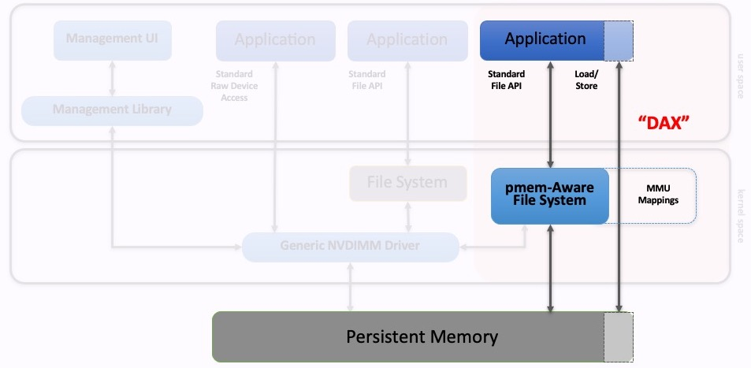

​		如上图所示，应用程序使用标准 API 打开文件，然后进行内存映射。 感知PMem的文件系统的工作是提供 DAX 映射，以便在应用程序访问内存范围时不会发生[paging](#paging)。

​		为了使 PMem 的存储持久化，可以使用刷新的标准 API（Linux 上的[msync](#msync)，或Windows上的[FlushViewOfFile](#flushviewoffile)）。编程模型还允许使用[CLWB ](#clwb)等指令直接将用户空间刷新持久化，但在 Linux 上仅在`mmap`使用`MAP_SYNC` 标志成功调用的情况下才允许。在 Windows 上，所有 DAX 映射都允许从用户空间刷新。

​		更多介绍查看[Linux doc on DAX](https://www.kernel.org/doc/Documentation/filesystems/dax.txt)。


### DDR

(Double Data Rate)

​		该**DDR**术语是各种版本的 DDR 协议的概括。[Wikipedia](https://en.wikipedia.org/wiki/DDR4_SDRAM)上讲解了DDR4 。

​		在谈论持久内存时，该术语用于谈论将哪些类型的内存插入到哪些类型的sockets中。例如，NVDIMM-N 产品通常像普通 DRAM 一样插入 DDR 插槽。英特尔的傲腾Optane PMem 可插入 DDR 插槽，但在 DDR 电子设备上运行[DDR-T](#ddrt)协议。


### DDR-T

​		**DDR-T**是在 Intel 平台上使用[傲腾Optane](#optane) PMem 产品插入系统的[DDR](#ddr)插槽的协议。


### Device DAX

(devdax)

​		Linux 支持[DAX](#dax)，它允许感知PMem文件系统在内存映射文件时让应用程序 *直接访问direct access* PMem。Linux 还通过称为**Device DAX**的配置在不使用文件系统的情况下支持**DAX**。Linux `ndctl`命令使用术语 `fsdax`和`devdax`在这两种类型的 DAX 之间进行选择，如 [ndctl-create-namespace](https://pmem.io/ndctl/ndctl-create-namespace.html) 手册页中所述。

​		在大多数情况下，可以像管理文件一样 PMem（包括命名、权限和 POSIX 文件 API），所以优先选择`fsdax`类型。`devdax`不遵循[PMem 编程模型](#programming-model)，因此普通文件API不能操作它。以下是 Linux 上` fsdax` 和`devdax` 之间的主要区别：

   - 在 fsdax 和 devdax 两种情况下，正常的 I/O 操作是加载load和存储store指令，它们允许直接从用户空间访问，数据操作不需要内核代码。

   - devdax 将整个命名空间 Namespace 作为单个设备公开，因为不使用文件系统，不能通过命名文件切分空间。

   - 缺少文件系统也意味着缺少文件权限，因此 devdax 需要以 root 身份运行应用程序，或者更改设备本身的权限。

   - devdax 提供对 PMem 的更多原始访问，因此应用程序更容易保证大页面的对齐。这是应用程序使用 devdax 的最常见原因，如 RedHat 在[此文所述](https://access.redhat.com/documentation/en-us/red_hat_enterprise_linux/7/html/storage_administration_guide/configuring-persistent-memory-for-use-in-device-dax-mode)。

   - 当系统知道PMem 中的[Bad Blocks](#bad-blocks)时，fsdax 会在这些区域映射无效页面，以防止应用程序使用损坏位置。在英特尔服务器上使用损坏位置会导致难以处理的*机器检查machine checks*。devdax 访问更加原始，允许映射包含损坏的页，因此应用程序在接触这些区域时会触发机器检查，即使系统已经知道该损坏。

   - devdax 允许 long-lived RDMA 内存注册，就像其它一些基于 RDMA 的库所需要的那样。这是应用程序使用Device DAX 的另一个最常见原因。使用 fsdax，不允许 long-lived RDMA 内存注册，只有支持*按需分页On-Demand Paging (ODP)* 的RDMA 卡才支持。

   - devdax 没有实现所有的 POSIX。例如，[msync](#msync) 不起作用，必须改用[CLWB ](#clwb)等指令刷新用户空间。查询PMEM的大小比起只调用`stat(2)`复杂更多，但[PMDK](#pmdk)库消除了这些差异，可以按照预想方式使用devdax。

   - 由于 devdax 不包含文件系统，因此文件系统提供的常见安全措施（譬如清零分配的块）是没有的。这意味着应用程序可以看到历史遗留的旧数据，因此应用程序设计人员必须考虑到这一点。

​		[PMDK](https://pmem.io/pmdk/manpages/linux/v1.10/daxio/daxio.1.html)提供了一个实用程序[daxio](https://pmem.io/pmdk/manpages/linux/v1.10/daxio/daxio.1.html)用于保存/恢复/清零 devdax 设备。

> I/O path个人译为I/O操作，data path译为数据操作


### Dirty Shutdown Count

(DSC, Unsafe Shutdown Count)

​		失败刷新Flush-on-fail机制（譬如[ADR](#adr)和[eADR](#eADR)）为[PMem](#adr)提供了一个[编程模型](#programming-model)，确保即使在突然断电的情况下，存储也能持久化。当失败刷新机制本身失败时，则持久化承诺不再有效，未刷新的存储数据会丢失。这种情况很少发生，通常是硬件故障的结果，但显然必须将其报告给软件以避免静默数据损坏。**Dirty Shutdown Count**就是这类故障报告给软件的方式。

​		当感知PMem应用程序开始使用 PMem 文件时，它会查找当前的 Dirty Shutdown Count 并将其存储在该文件的头信息中。每次打开文件时，都会根据存储的计数检查当前计数，以查看是否发生了Dirty Shutdown。如果发生了这种情况，应用程序应该认为文件处于未知状态。应用程序可能会尝试修复文件，但最常见处理是当作文件已丢失，并从冗余数据（例如备份副本）中恢复它。

​		[PMDK](https://pmem.io/glossary/#pmdk)库存储和检查 Dirty Shutdown Count 的操作如上文所述，将拒绝打开没有通过检查的任何资源。


### DRAM

(Dynamic Random Access Memory)

​		**DRAM**是当今几乎所有计算机采用的传统主内存存储器。

​		[持久性内存](persistent-memory)可以由DRAM制成，这正是市场上的NVDIMM-N产品所做的。使用 NVDIMM-N，PMem 以 DRAM 速度运行，因为它实际上是 DRAM，当断电时，NVDIMM-N 将数据持久保存在 NAND 闪存芯片上。

​		[持久性内存](https://pmem.io/glossary/#persistent-memory)可以由非 DRAM 的其他介质制成。例如，英特尔的 [傲腾Optane](#optane) PMem 使用[3D XPoint](#3d-xpoint)作为其介质。

​		通过比较NVDIMM-N 和 Intel 的 傲腾Optane ，得出一个产品是否被认为是 PMem，更多的是它提供的[编程模型](#programming-model)，而不是实现该模型使用的介质类型。


### DSM

(Device Specific Method, _DSM)

​		ACPI 定义了Device Specific Method 的概念，通常命名如**_DSM**，它允许预引导环境消除一些硬件细节，并为操作系统提供统一的调用接口。NVDIMM 的标准 DSM 由 ACPI 规范描述，可在 [UEFI 网站上获得](https://uefi.org/)。此外，英特尔发布了[DSM Interface for Optane](https://pmem.io/documents/IntelOptanePMem_DSM_Interface-V2.0.pdf) (pdf)。


### eADR

(Extended ADR)

​		**eADR**是一种硬件功能，可在**断电时**将存储从*CPU 缓存*和*内存控制器写入挂起队列 (WPQ)*刷新到目的地。


​		如上图所示，在通往持久内存 DIMM 的途中，存储可以驻留在多个位置。下面的红色虚线框显示了 ADR 域——到达该区域的存储数据受到[ADR ](#adr)断电保护，它会刷新内存控制器中的队列，如图中的梯形所示。所有支持持久内存的英特尔系统都需要 ADR。图中较大的红色虚线框说明了一个可选的平台功能**eADR**，用于 CPU 缓存刷新。

​		eADR 使用储存的电量在断电后执行刷新。

​		BIOS 使用[NFIT](#nfit)表中的字段通知操作系统 CPU 缓存需要断电持久化保护。反过来，操作系统通常会为应用程序提供一个接口，以发现它们是否需要使用像[CLWB](#clwb)这样的缓存刷新指令，或者它们是否可以依赖 eADR 提供的断电自动刷新。使用 [PMDK](#pmdk)将允许应用程序自动检查 eADR 并根据需要跳过缓存刷新指令。


### Fence

(SFENCE)

​		**Fence**是程序员常用来排序内存操作的排序指令。对于 Intel 架构，[软件开发手册](http://intel.com/sdm)(SDM)中描述了 fence 指令的复杂细节。对于[持久内存](https://pmem.io/glossary/#persistent-memory)编程，*SFENCE* 指令特别有趣。SFENCE 的排序属性由 Intel 的 SDM 描述如下：

> 处理器确保在 SFENCE 之后的任何存储变为全局可见之前，SFENCE 之前的每个存储都是全局可见的

​		对于具有[eADR](#eadr)系统，全局可见性意味着持久性，SFENCE 指令具有双重用途，即存储数据对其他线程可见和持久化。

​		对于需要缓存刷新以使存储持久化的[ADR](https://pmem.io/glossary/#adr)系统，必须确保已刷新的存储数据已被内存子系统接受，以便将它们视为持久存储。像[CLWB](https://pmem.io/glossary/#clwb)这样的缓存刷新指令是异步*启动*和运行的。在假定刷新范围是持久的情况下，软件可以继续之前，它必须发出 SFENCE 指令。

​		[PMDK](#pmdk)库旨在消除 SFENCE 等复杂指令的细节，以便应用程序开发人员更轻松地进行 PMem 编程。


### FlushViewOfFile

(Windows Flush System Call)

​		[PMem 编程模型](#programming-model)的一项原则是标准文件API同样能在 PMem 文件上操作。对于 Windows，用于内存映射文件的标准 API 是 [MapViewOfFile](#mapviewoffile)，将任何存储刷新到该范围以使其持久化的标准方法是**FlushViewOfFile**。

​		在 Windows 上，当 PMem 文件被[DAX](#dax)映射时，还可以使用[CLWB](#clwb)等刷新指令直接从用户空间刷新存储。这通常比使用系统调用进行刷新要快得多，但两者都可以。

​		需要注意的是，根据[微软的文档](https://docs.microsoft.com/en-us/windows/win32/api/memoryapi/nf-memoryapi-flushviewoffile)，FlushViewOfFile可以在刷新完成前返回，因此通常调用FlushViewOfFile后调用*FlushFileBuffers*。

​		Windows 上的 FlushViewOfFile 大致相当于POSIX 系统上的[msync](#msync)。


### Interleave Set

​		维基百科上的[Interleaved Memory](https://en.wikipedia.org/wiki/Interleaved_memory)条目描述了如何使用交错来提高性能，类似于跨存储阵列中的磁盘进行条带化。对于[持久内存](#persistent-memory)，还有另一个考虑。由于 PMem 是持久化的，因此系统每次配置 PMem 时都必须以相同的方式构造交错集，否则持久化数据会在软件中出现乱码。

​		PMem 交错集是如何每次以相同的方式创建的，这是[NVDIMM](#nvdimm)的产品特定细节。对于[CXL](#cxl)上的持久内存 ，已经定义了一个标准机制：*区域标签 region labels*。这些标签永久存储在 CXL 规范定义的 [标签存储区域中](#label-storage-area)。

​		Linux 和 CXL 规范也将交错集称为[区域region](#region)。


### KMEM DAX

​		**KMEM DAX**是[内存模式](#memory-mode)的半透明semi-transparent替代方案，用于使用易失性的 PMem。 [Device DAX](#device-dax) 可以配置为[system-ram mode](https://pmem.io/ndctl/daxctl-reconfigure-device.html). 此模式将 PMem 公开为热插拔内存区域。以这种方式配置，持久性内存采用单独的仅内存 NUMA 节点的形式。与**内存模式Memory Mode** 不同，PMem 表示为由操作系统明确管理的独立内存资源。有关 KMEM DAX 的更多信息，请参阅[KMEM DAX 博客文章](https://pmem.io/2020/01/20/memkind-dax-kmem.html)。


### Label Storage Area

(LSA)

​		持久内存设备（例如[NVDIMM](#nvdimm)）可以划分出逻辑分区（如[命名空间namespace](#namespace)）。在 [ACPI规范](https://uefi.org/)描述了管理命名空间的标准方式，通过创建*命名空间标签*并将其存储在**标签存储区**（LSA）。

​		该[CXL规范](https://pmem.io/glossary/#cxl)扩展了LSA的想法，同时存储命名空间标签和[区域region](https://pmem.io/glossary/#region)标签。

​		通常，LSA 是一个相当小的保留区域，大小为数十 KB。它是持久的，读写它的特定方式有助于检测错误，例如交错集中丢失的设备。


### libmemkind

​		**memkind**库主要是使用的Pmem的易失性功能，其中软件忽略Pmem的持久性功能，使用它是出于容量和价格的考虑。 **memkind**在内部使用流行的**jemalloc**库为多个独立堆提供灵活的分配器。更多信息可以在[memkind网站](http://memkind.github.io/memkind/)。


### libpmem

​		**libpmem**库提供低级持久内存的操作支持。像更高级别[libpmemobj](#libpmemobj)库在新的[libpmem2](#libpmem2)出现前，是基于**libpmem**实现的。[PMDK网站](https://pmem.io/pmdk/)包含了所有PMDK的 [GitHub](https://pmem.io/repoindex)上开源的库的文档。


### libpmem2

​		**libpmem2**库提供低级持久内存的操作支持，是原来的[libpmem](#libpmem)库的替代者。 **libpmem2**提供了更通用且与平台无关的接口。希望推出自己的持久内存算法的开发人员会发现这个库很有用，但大多数开发人员可能会直接使用*提供内存分配*和*事务支持*的[libpmemobj](#libpmemobj)高级库。libpmemobj 是基于**libpmem2**实现的。[PMDK网站](https://pmem.io/pmdk/)包含了所有PMDK的 [GitHub](https://pmem.io/repoindex)上开源的库的文档。


### libpmemblk

​		**libpmemblk** 库支持大小相同的pmem-resident blocks常驻块的数组的原子更新。例如，在 pmem 中保存固定大小对象缓存的程序可能会发现这个库很有用。**libpmemblk**使用的算法与[UEFI 规范](https://uefi.org/) 标准化的[BTT](#btt)算法相同。[PMDK网站](https://pmem.io/pmdk/)包含了所有PMDK的 [GitHub](https://pmem.io/repoindex)上开源的库的文档。


### libpmemkv

​		**libpmemkv**库提供本地/嵌入式的键值数据存储在持久内存上的优化。**pmemkv**不局限于单一语言或实现支持，而是为语言绑定和存储引擎提供了不同的选项。[PMDK网站](https://pmem.io/pmdk/)包含了所有PMDK的 [GitHub](https://pmem.io/repoindex)上开源的库的文档。


### libpmemlog

​		**libpmemlog**库提供一个Pmem常驻日志文件。这对于频繁追加日志文件的数据库等程序很有用。[PMDK网站](https://pmem.io/pmdk/)包含了所有PMDK的 [GitHub](https://pmem.io/repoindex)上开源的库的文档。


### libpmemobj

​		**libpmemobj**库是[PMDK](#pmdk)集合中最流行和最强大的类库。它提供了一个事务对象存储，为持久内存编程提供内存分配、事务和通用服务。不熟悉持久内存的开发人员可以想从这个库开始入手。[PMDK网站](https://pmem.io/pmdk/)包含了所有PMDK的 [GitHub](https://pmem.io/repoindex)上开源的库的文档。


### librpma

​		**librpma**提供用于*远程访问持久内存*的API。该[PMDK](#pmdk)库旨在帮助应用程序使用 RDMA 访问远程 PMem。

​		详细信息请参阅[librpma 手册页](https://pmem.io/rpma/manpages/master/librpma.7.html)。


### LLPL

(Java Low Level Persistence Library)

​		**LLPL**是 Java 低级持久内存库，提供了对持久内存分配持久堆上的块的访问。可以在[LLPL GitHub](https://github.com/pmem/llpl)上找到更多信息。


### MapViewOfFile

(Windows Memory Map System Call)

​		Windows 文件 API 包括使用系统调用**MapViewOfFile**对文件进行内存映射的能力。

​		内存映射文件在应用程序的地址空间中显示为一系列虚拟内存，允许应用程序像加载和存储内存一样访问它。对于存储中的文件，这是有效的，因为当应用程序访问该page时，操作系统使用[paging](https://pmem.io/glossary/#paging)将页面的内容拉到[DRAM](#dram)中。对于[持久内存](https://pmem.io/glossary/#persistent-memory)，感知PMem文件系统允许内存映射文件直接访问 PMem，该功能称为[DAX](#dax)。

​		在[Windows文档](https://docs.microsoft.com/en-us/windows/win32/api/memoryapi/nf-memoryapi-mapviewoffile)中包含关于如何使用这个系统调用的细节。

​		基于 POSIX 的系统（如 Linux）上的等效系统调用是[mmap](https://pmem.io/glossary/#mmap)。


### Memory Mode

(2LM)

​		[Intel 的 Optane PMem](https://pmem.io/glossary/#optane)产品可以配置为两种模式：[App Direct](#app-direct)和**Memory Mode**。有关产品详细信息，请参阅 [英特尔傲腾](http://intel.com/optane)。下面我们对**内存模式**进行了描述，理解它与持久内存的关系。

​		**内存模式**结合了两层内存，DRAM 和 PMem，有时也称为**2LM**或**two-level memory**。

​		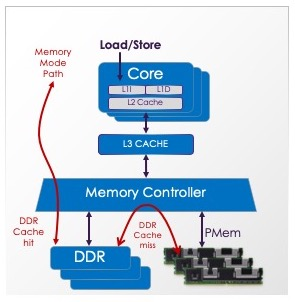

​		以这种方式配置时，系统 DRAM 充当内存端缓存。当访问缓存命中时，数据以 DRAM 性能从 DRAM（*近内存*）返回。当访问缓存未命中时，以 PMem 性能从 PMem（*远内存*）获取数据。Intel 的内存模式在内存端缓存中使用 64 字节大小的缓存行。

​		**内存模式**是持久内存的易失性用途，软件不需要内存的持久功能，事实上，傲腾Optane PMem 设备会在每次启动时以加密方式扰乱数据，以确保预期的易失性volatile语义。

​		尽管从技术上讲，这种**2LM**配置在任何两层内存之间都是可行的，但其主要流行是提供高容量的系统主内存，而不需要花费相同容量的 DRAM 成本。


### mmap

(POSIX Memory Map System Call)

​		POSIX 文件 API 包含使用系统调用**mmap**来对文件进行内存映射的能力。

​		内存映射文件在应用程序的地址空间中显示为一系列虚拟内存，允许应用程序像加载和存储内存一样访问它。对于存储的文件，这是有用的，因为当应用程序访问该页时，操作系统使用[分页](#paging)将页的内容带入[DRAM](https://pmem.io/glossary/#dram)。对于[持久内存](#persistent-memory)，感知PMem文件系统允许内存映射文件直接访问 PMem，该功能称为[DAX](#dax)。

​		Linux 持久内存支持包括一个新的 mmap 标志，`MAP_SYNC`. 使用 MAP_SYNC 成功的 DAX 映射意味着应用程序可以安全地使用[CLWB ](#clwb)等指令将其更改刷新持久化。如果没有`MAP_SYNC`，确保持久性的唯一方法是使用标准的系统刷新调用命令，如[msync](#msync)。

​		在[Linux手册页](https://man7.org/linux/man-pages/man2/mmap.2.html) 包含关于如何使用这个系统调用的细节。

​		Windows 上的等效系统调用是[MapViewOfFile](#mapviewoffile)。


### msync

(POSIX Flush System Call)

​		[PMem 编程模型](#programming-model)的一项原则是标准文件 API 也能在 PMem 文件上正常工作。对于像 Linux 这样的 POSIX 系统，用于内存映射文件的标准 API 是 [mmap](#mmap)，而将任何存储刷新持久化到该区域的标准方法是**msync**。

​		当使用MAP_SYNC标志将PMem文件成功地[DAX](#dax)映射到mmap时，也可以使用[CLWB](#clwb)等刷新指令直接从用户空间刷新到存储。这通常比使用系统调用进行刷新要快得多，但两者都可行。

​		POSIX 系统上的 msync 大致相当于Windows上的 [FlushViewOfFile](#flushviewoffile)。


### Namespace

​		**命名空间**是划分容量到逻辑设备的一种方法。这与将 SCSI 存储阵列划分为 SCSI 逻辑单元 (LUNs) 的方式类似。NVM Express 规范定义了命名空间在 NVMe SSD 上的工作方式，ACPI 规范定义了命名空间在[NVDIMM 上](#nvdimm)工作方式。NVDIMM 版本在 CXL 2.0 中被扩展并添加到 [CXL](#cxl)规范中，以便 CXL 上的 PMem 可以用相同方式定义命名空间。

​		持久内存命名空间的管理比传统存储更复杂，因为容量通常跨设备交错。为了便于管理，命名空间通过每个设备上存的*命名空间标签*来定义。这些标签存储在每个设备上的[标签存储区](#label-storage-area)中。

​		在 Linux 上，[ndctl](#ndctl)命令提供了一种与产品无关的方法来管理命名空间。更多详细信息请参阅[create-namespace](https://pmem.io/ndctl/ndctl-create-namespace.html)命令。


### ndctl

​		在 Linux 系统上，**ndctl**命令提供[NVDIMM](#nvdimm)设备的管理 。此命令是供应商中立的，遵循开放标准，例如 ACPI 规范中的 NVDIMM 。

​		某些产品还可能具有特定于供应商的命令来执行其他管理任务。例如，英特尔的[傲腾Optane PMem](#optane) 是使用`ipmctl`命令管理。

​		详细信息请参阅[ndctl 手册页](https://pmem.io/ndctl/)。


### NFIT

(NVDIMM Firmware Interface Table)

​		[ACPI规范](https://uefi.org/)定义了一个称为 NVDIMM 固件接口表或**NFIT**表。该表用于报告系统是否存在[持久内存](#persistent-memory)。当操作系统检测到此表时，通常会触发加载支持 NVDIMMs 的各种模块/驱动程序。

​		顾名思义，NFIT 仅适用于 NVDIMMs。与任何PCIe设备一样，操作系统将使用标准PCIe总线遍历查找连接到[CXL](#cxl)的PMem。


### NT Store

(Non-Temporal Store)

​		英特尔[软件开发手册](http://intel.com/sdm)(SDM) 描述了一种称为` _non-temporal stores*` 或`NT Stores`的存储类型。手册的摘录描述了它们存在的原因：

> 程序引用的数据可以分为长期有用 temporal 的（数据将被再次使用）或临时用 non-temporal 的（数据被引用一次后不再使用）。例如，程序代码通常是长期有用，而多媒体数据例如 3-D 图形应用程序中的显示数据通常是临时用。为了更利用处理器的缓存，通常需要缓存长期有用的数据而不缓存临时用的数据。临时数据重载到处理器缓存有时被称为“污染缓存”。SSE 和 SSE2 缓存控制指令使程序能够以最小化污染缓存的方式将临时数据写入内存。

​		对于[持久内存](https://pmem.io/glossary/#persistent-memory)，NT Store 有助于绕过 CPU 缓存，存储持久化时不需要额外使用像[CLWB](https://pmem.io/glossary/#clwb)这样的刷新指令。需要注意的是，Intel 的 NT Store 是*写组合 write combining* 而不是普通内存的*写回 write back*。这意味在发出像 SFENCE 这样的[fence](#fence)指令之前，这些存储不一定对其他线程全局可见。

​		像[PMDK](#pmdk)这样的库大量使用 NT Store。例如[libpmem](#libpmem) 库，使用试探法 heuristics 决定使用 write-back-cached 指令或 NT stores 更好地复制内存范围。


### NVDIMM

(Non-Volatile Dual In-line Memory Module)

​		JEDEC 标准组织定义了多种类型的 **NVDIMM**，它们在 DIMM 结构上提供一些持久性。对于[持久内存](#persistent-memory)， [PMem 编程模型](#programming-model)支持的两种 *NVDIMM* 类型是 *NVDIMM-N* 和 *NVDIMM-P*。在 DIMM 结构上的第三种 PMem是英特尔的[傲腾Optane PMem](#optane) ，它使用专有的[DDR-T](#ddr-t)协议。


### NVM

(Non-Volatile Memory)

​		在现代用法中，**NVM**指的是在断电时不会丢失信息的一类产品。与 [持久内存persistent-memory](#persistent-memory) 的现代用法进行比较，后者添加了加载/存储访问能力。 NVM 通常可以指像 SSD 或 PMem 之类的存储。持久内存不是指[块存储的产品](#block-storage)。


### Optane

(DCPMM, DCPM)

​		**Optane**是英特尔使用[3D XPoint](#3d-xpoint)介质的产品线的品牌名称。该系列包括 Optane SSD（提供[块存储](#block-storage)接口）和 Optane PMem（提供[PMem 编程模型](#programming-model)）。

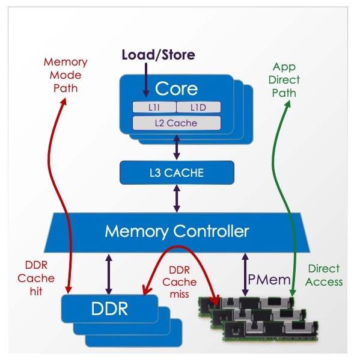

​		如上图所示，Optane PMem 产品支持易失性模式，称为[Memory Mode](#memory-mode)，它使用[DRAM](#dram)作为 PMem 前置缓存。Optane PMem 还支持持久模式，称为[App Direct](#app-direct)，用于 PMem 用例。

​		[PMDK](#pmdk)库用于Pmem编程，尤其是用于Optane PMEM的[App Direct](#app-direct)模式。

​		有关傲腾的详细信息，请参阅[英特尔的傲腾官网](https://intel.com/optane)。


### Paging

​		在访问[块存储](https://pmem.io/glossary/#block-storage)上的数据结构时，**分页** 用于根据需要将适当的块带入 DRAM。分页可以对应用程序透明（即内核分页），或者应用程序可以自己管理分页（大多数高端数据库的场景）。

​		[持久性内存](#persistent-memory)不需要分页访问，因为根据定义，它是可字节寻址的。这在多个方面都优于存储，因为没有分页意味着更低的延迟、不变的延迟，并且不需要从 DRAM 中驱逐其他数据来为入站页腾出空间。但是，一些 感知PMem应用程序可能仍会在 PMem 和 DRAM 之间移动块，以利用 DRAM 更高的性能来处理热数据。

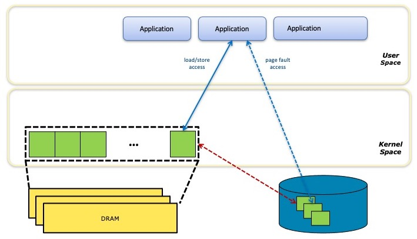

​		上图说明了如何使用分页实现基于存储的内存映射文件。应用程序通过字节可寻址访问 DRAM 中的文件数据，但当出现**页面缓存未命中时**，系统会暂停应用程序，同时将Page从块存储移动到 DRAM，可能会先驱逐另一个Page以腾出空间。


### PCJ

(Persistent Collections for Java)

**PCJ**是一个为 Java 提供持久集合的*实验性*库。更多信息查阅[PCJ GitHub 页面](https://github.com/pmem/pcj)。


### Persistence Domain

(Power Fail Safe Domain)

​		**Persistence Domain**是指软件认为存储到达该域后就算持久化的区域。对于[ADR](#adr)系统，Persistence Domain 是内存控制器——一旦存储被内存子系统接受，应用程序可以假设存储已持久。对于[eADR](#eadr)系统，当存储数据达到全局可见性时，就算到达持久域。


### Persistent Memory

(PMem, pmem, PM)

​		[SNIA](#snia) NVM编程技术工作组在他们的论文中定义 **Persistent Memory**， [Pmem编程模型](#programming-model)：

> 具有适用于加载和存储编程模型的性能特征的存储技术

​		对于被视为持久内存的设备，它必须支持加载/存储编程模型并且足够快，以便软件以这种方式合理使用它。

​		完整的[SNIA NVM 编程规范](https://www.snia.org/tech_activities/standards/curr_standards/npm)包含有关持久内存语义的更多详细信息。


### PMDK

(Persistent Memory Development Kit)

​		**持久性存储器开发工具包**（**PMDK**） 是一系列库和工具的集合，致力于使持久性存储器编程更容易。这些库在 Linux 和 Windows 上进行了调整和验证，建立在这些操作系统的[DAX](#dax)功能上，允许应用程序访问持久内存作为内存映射文件，如 [SNIA NVM 编程模型](https://pmem.io/glossary/#programming-model)中所述。

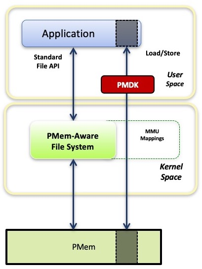

​		PMDK 的源代码分布在多个 [GitHub](https://pmem.io/repoindex) 项目中。 PMDK 库适合 PMem 编程模型，如图所示，其中应用程序可以从 PMDK 获取他们需要的内容，也可以继续使用模型提供的直接访问direct access。

​		由于PMem可以使用普通文件 API，因此应用程序也可以使用它们，或使用任何构建在存储 API 上的库。但是这些 API 都是*基于缓冲区 buffer based* 的，要求通过应用程序提供的 DRAM 缓冲区来进出拷贝数据。PMDK 库提供分配和事务等功能，同时仍允许应用程序直接加载/存储访问其数据结构。

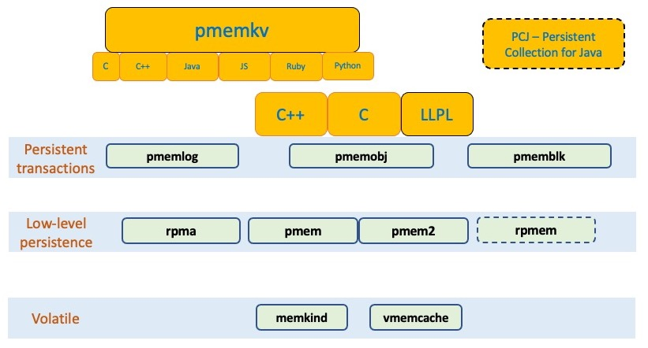

​		上图显示了 PMDK 库的快速概览。volatile 库使用 PMem 作为存储，但不提供持久性，[memkind](#libmemkind)库是 volatile 用例中最常见的。

​		低级库，如[libpmem2](#libpmem2)提供基本的数据移动和缓存刷新。更高级别的库建立在它们之上。

​		最灵活和最常用的库是[libpmemobj](#libpmemobj)。

​		[pmemkv](#libpmemkv)库提供了最高级别、最容易使用的接口，用于PMEM感知key-value形式的存储。

​		[PMDK网站](https://pmem.io/pmdk)中详细介绍如何使用这些库。


### PMem Programming Model

**PMEM编程模型**有关的细节见[编程模型](#programming-model)


### pmemhackathon

(Persistent Memory Programming Workshop)

​		多年来举办了一系列关于使用[持久内存](https://pmem.io/glossary/#persistent-memory)编程的研讨会，通常称为**PMem 黑客马拉松**。每个研讨会都包括一系列功能齐全的示例，对我而言，它们用来入门 PMem 编程。这些研讨会示例的存档位于[pmemhackathon.io](https://pmemhackathon.io/)，每个示例都以研讨会的日期命名。


### PMoF

(Persistent Memory over Fabrics)

​		过去曾使用**PMoF**来指代 RDMA 访问远程持久内存。现在更常用的术语是[rpmem](#rpmem)。


### Poison

​		在英特尔服务器上，访问出现数据丢失（例如无法纠正的错误）的内存位置时会返回一个特殊的**Poison**值。使用Poison位置会触发*机器检查*事件，内核将异常返还给的使用Poison值的应用程序（内核本身是不可能使用Poison位置的，如果内核无法恢复，这会导致系统崩溃）。

​		有关毒物如何影响[持久内存](#persistent-memory)感知应用程序的更多信息 ，请参阅有关[不可纠正错误](#uncorrectable-error) 和[爆炸半径blast-radius](#blast-radius)概念的条目。


### Pool

​		**Pool**是[PMDK](#pmdk)的一个概念，它是指系统分配的一些[持久存储](#persistent-memory)容量。Pool 通常只是感知PMem文件系统上可用于 PMDK 库的一个文件。使用术语*Pool*而不是*文件 file*是因为有时一个 Pool 可能包含多个文件（请参阅[poolset](#poolset)上的条目 ），有时一个 Pool 可能是[DAX](#device-dax) 设备。使用 PMDK 的应用程序将消除这些差异，只需使用Pool概念，而不必处理向 PMDK 提供容量的所有方式。


### Poolset

​		**poolset**是[PMDK](https://pmem.io/glossary/#pmdk)概念，其中多个文件或[DAX](#device-dax)设备被组合成单个逻辑Pool。Poolset 还支持应用程序透明的复制（至少在发生故障和需要管理操作之前）。

​		详细信息请参阅 [Poolset手册](https://pmem.io/pmdk/manpages/linux/v1.4/poolset/poolset.5)。


### Programming Model

​		**Programming Model 编程模型**可以关联[持久内存](#persistent-memory)多个方面 。

​		在最底层，编程模型描述了如何与硬件接口交互。对于持久内存，该接口类似于系统内存，其中访问通过加载和存储 CPU 指令进行。在此级别，还定义了[持久域 persistent-domain](#persistent-domain)。例如，在 Intel 硬件上，[CLWB](#clwb)等指令用于使存储持久化，[ADR](#adr)和[eADR](#eadr)等定义使用这些指令的方式和时间。

​		*编程模型的*另一个用途是描述应用程序如何从操作系统访问持久内存。这是 SNIA NVM 编程模型适用的地方。	

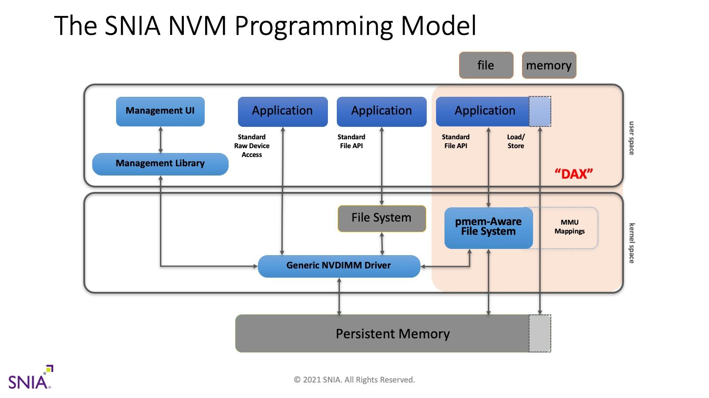

​		如上图所示，PMem 编程模型是一个通用的、操作系统和供应商中立的模型，其中持久内存由内核驱动程序（图中称为*通用 NVDIMM 驱动程序*）管理。该驱动程序提供用于管理 PMem 的运行状况和配置（左侧路径）的访问权限。它还提供对标准 [块存储](#block-storage)的访问接口（中间路径），以便为传统存储设计的文件系统和应用程序无需修改即可运行。右侧路径是大多数持久内存编程的重点，其中 PMem 感知文件系统将 PMem 当作文件。

​		*PMem-aware 文件系统*的定义是当文件被内存映射时绕过系统页面缓存的文件系统。这意味着应用程序可以使用标准 API 映射 PMem 文件，例如Linux 上的[mmap](#mmap)和Windows上的[MapViewOfFile](#mapviewoffile)，结果将是[DAX](https://pmem.io/glossary/#dax)映射文件，使应用程序可以直接加载/存储访问持久内存本身。与普通内存映射文件（操作系统根据需要对 DRAM执行[分页](#paging)）不同，应用程序能够直接访问位于PMem中的持久内存数据结构。

​		[PMDK](#pmdk)库是这种编程模型的顶层设计，为持久内存的操作提供更方便的抽象。应用程序级别的这种使用的工具和库，通常也使用*编程模型*来描述。这意味着我们已经描述了*编程模型的*三个定义（硬件接口、操作系统公开 PMem 的方式以及应用程序可用的完整编程环境）。该术语的所有用法都是可行的，但最常见的用法如 SNIA 模型所述。

​		除了上述 PMem 编程模型之外，Linux 系统还提供了一种称为[设备 DAX](#device-dax)的替代方案。下图总结了可用于访问持久内存的各种方法。

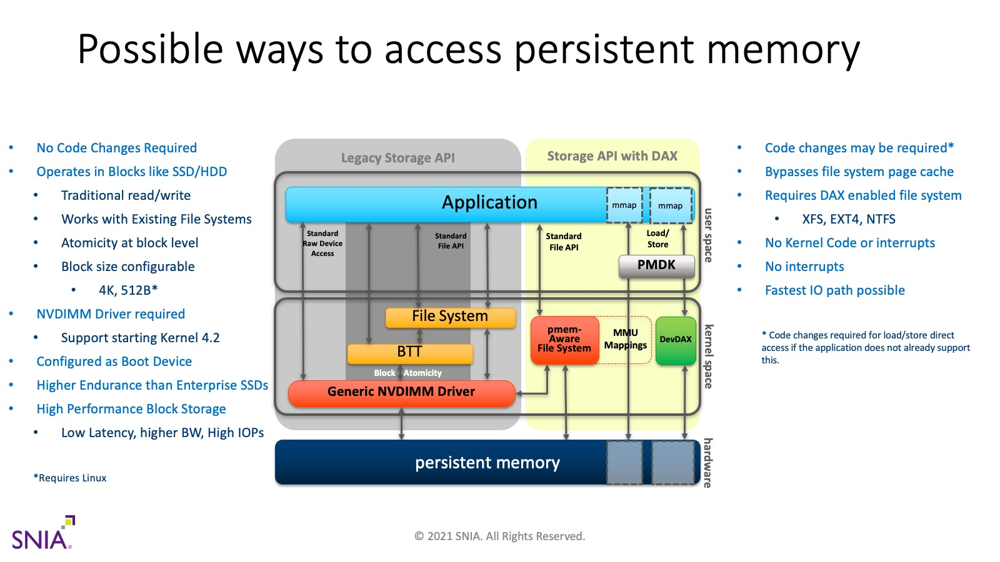


### Region

​		**区域 Region**是[交织集interleave-set](https://pmem.io/glossary/#interleave-set)的另一种叫法。Linux 工具（例如[ndctl](#ndctl)）使用该术语，[CXL](#cxl) 规范也是如此。


### RPMEM

(Remote Persistent Memory)

​		由于 PMem 可以像内存一样访问，因此直接访问内存的技术也适用于 PMem。RDMA 就是一个令人兴奋的例子，它允许低延迟、直接访问**远程持久内存**。

​		[PMDK](#pmdk)库[librpma](#librpma)旨在帮助应用程序通过[持久性存储器](#persistent-memory)使用RDMA。

​		使用 RPMEM 的一个优秀应用程序是 Oracle Exadata，如[他们的博客中所述](https://blogs.oracle.com/exadata/persistent-memory-in-exadata-x8m)。


### SNIA

(Storage Networking Industry Association)

根据[SNIA 网站](https://snia.org/)，他们的使命宣言是：

> 引领全球存储行业开发和推广供应商中立的架构、标准和教育服务，以促进信息的高效管理、移动和安全。

对于[持久内存](#persistent-memory)，SNIA 在定义[NVM 编程规范](https://www.snia.org/tech_activities/standards/curr_standards/npm)所描述的[PMem 编程模型](#programming-model)方面发挥了核心作用。

​	

### Storage Class Memory

(SCM)

​		**Storage Class Memory**是[持久内存](#persistent-memory)的同义词 。在[SNIA](https://pmem.io/glossary/#snia) 文档更喜欢用**persistent memory**，但是这两个术语在本专题的学术论文中都能找到使用。


### Transaction

​		在持久内存编程的世界中，**事务**是维护持久数据结构一致的常用工具。程序员最熟悉需要在存储上保持一致的数据结构，例如存储在磁盘上的数据库。诸如*预写日志记录 write ahead logging*之类的技术通常用于确保数据库在遇到意外故障（如系统崩溃或电源故障）时处于一致状态。

​		对于传统[DRAM中的](#dram)数据结构，应用程序员熟悉*多线程*编程技术，以确保每个线程在访问数据结构时看到的状态一致。但是如果程序崩溃或系统断电，那些驻留在 DRAM 的数据结构就会消失，因此不需要像上面的数据库示例那样进行日志记录。

​		[持久内存](#persistent-memory) 将这两个世界结合在一起：持久内存常驻数据结构通常被多线程编程技术以及事务/日志技术覆盖，以确保持久数据结构在面对故障时的一致性。由于 PMem 是可加载/存储的，比[块存储](/#block-storage)相比，可以以更优化、更细粒度的方式实现事务。

​		[PMDK](#pmdk)库[libpmemobj](https://pmem.io/glossary/#libpmemobj)提供了在PMEM常驻数据结构的事务支持。


### Uncorrectable Error

​		当存储设备遇到无法**纠正的错误时**，通常会导致应用程序在使用存储 API 访问丢失的数据时将错误传回给应用程序。但是对于[持久内存](https://pmem.io/glossary/#persistent-memory)，此类错误的行为更类似于[DRAM](#dram)而不是存储。

​		当服务器应用程序读取包含不可纠正错误的内存位置时，系统必须返回异常以防止应用程序使用损坏的数据。在英特尔服务器上，CPU 被发送一个*poison value*来表示丢失的数据，当poison被软件使用时，英特尔服务器会生成一个*机器检查异常*。此异常允许内核向应用程序返回异常，例如向 Linux 应用程序发送*SIGBUS*信号。在某些情况下，机器检查对系统来说是致命的，因此它会导致崩溃（例如，当内核本身是poison的使用者时）。

​		持久内存感知应用程序在 PMem 中遇到无法纠正的错误，就像它们在 DRAM 中所做的一样。不同之处在于，当应用程序由于 DRAM 无法纠正的错误而崩溃时，该 poison 位置在应用程序重新启动时消失了——易失性内存总是从新开始，之前运行的内容不会保留。

​		显然，PMem 是不同的，其内容被设计为保留下来。因此，如果应用程序由于 PMem 中不可纠正的错误而崩溃，它很可能会在重新启动后再次尝试访问相同的位置，并由于同样的不可纠正的错误而再次崩溃。这导致对 PMem 感知应用程序的更复杂要求，以避免这些循环崩溃。为了解决这种情况，系统需要提供一个已知[bad-blocks](#bad-blocks)的列表，以便应用程序可以避免访问这些区域。应用程序架构师还必须意识到不可纠正错误的 [爆炸半径blast-radius](#blast-radius)，当它们发生时，这可能导致比单个内存位置更多的数据丢失。

​		此[文章Optane RAS](https://software.intel.com/content/www/us/en/develop/articles/pmem-RAS.html) 包含关于此主题的更多细节。

